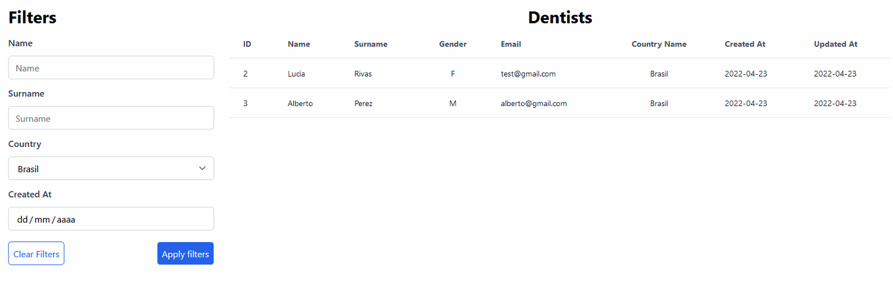
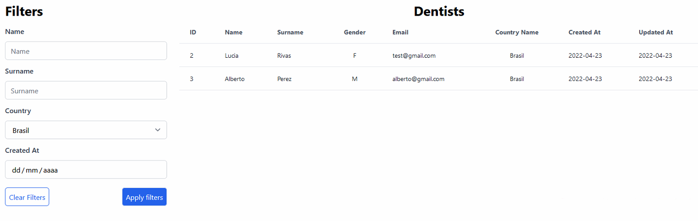

# KSS Challenge

KSS Challenge hecho por Facundo Agüeria, utilizando Laravel, vue js y tailwindcss

## Aclaraciones

Dentro de la carpeta "databases" hay un backup de la base de datos MySQL que utilicé.

Dentro de la carpeta "vue" está todo el front end.

## Imágenes

